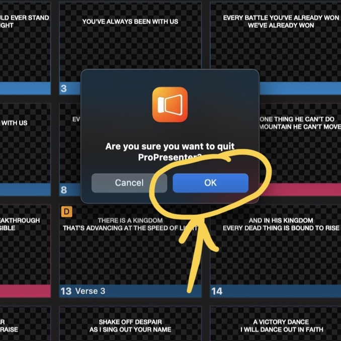

# Turning the Media Equipment Off

**This guide is not yet complete and may be out of date**.

## ProPresenter and TVs

1. (Optional) Quit ProPresenter by clicking “ProProsenter” at the top left of the screen and the clicking quit.
   
2. Turn the TVs off.
3. Close the ProPresenter computer.
