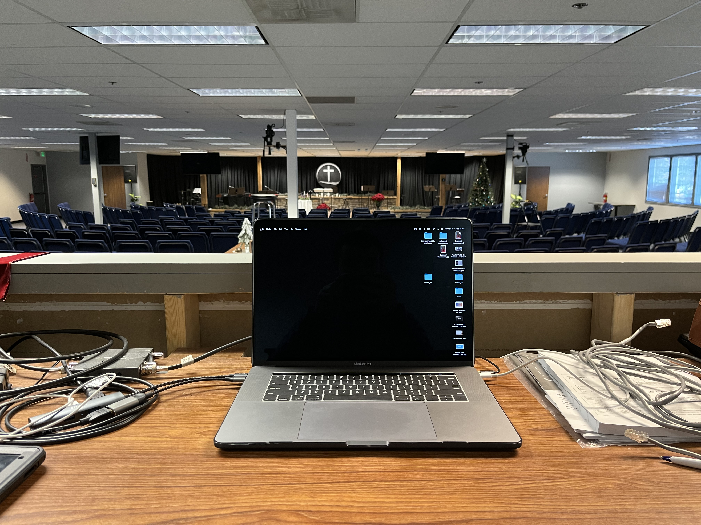
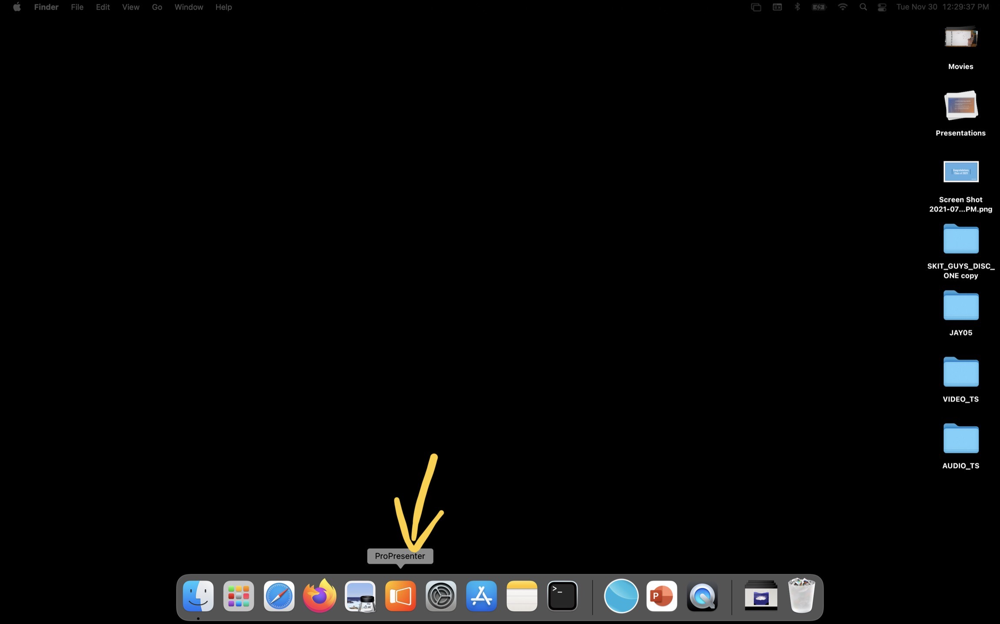
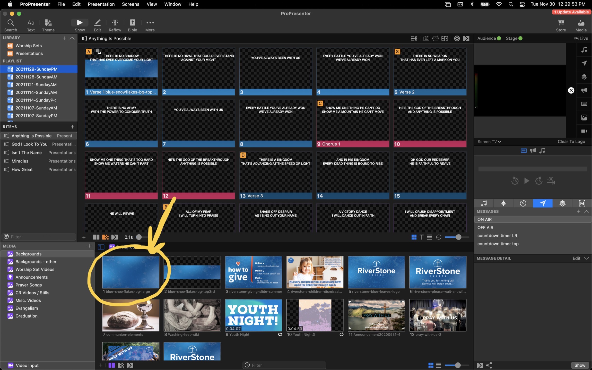
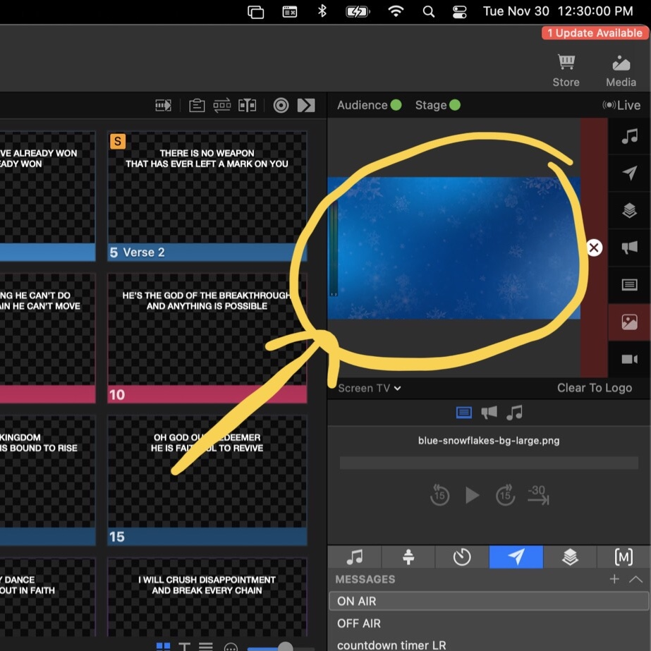
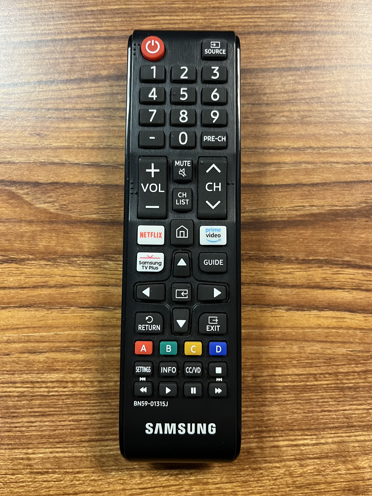
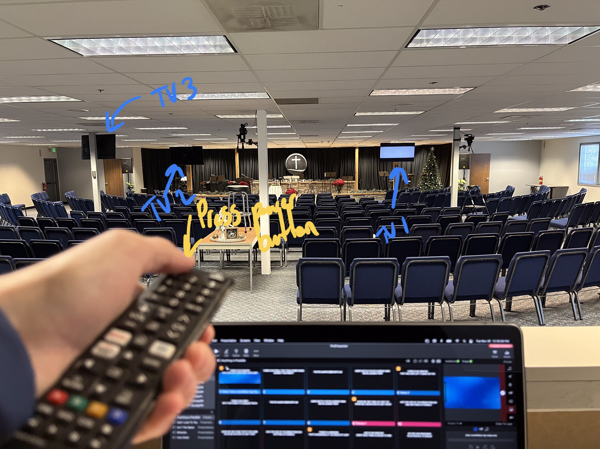
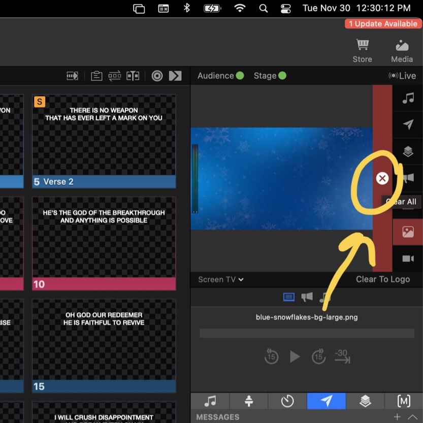
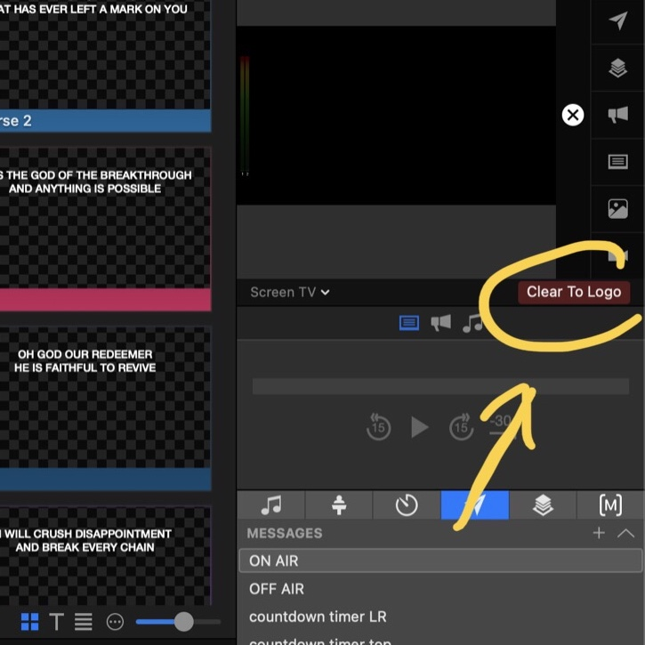

# Turning the Media Equipment On

**This guide may not be accurate anymore.**

## ProPresenter and TVs

1. Open up the ProPresenter computer.
   
2. If ProPresenter is not already open, click the ProPresenter icon in the dock to open it.
   
3. (Optional) Click on any slide just to have something displayed when you turn the TVs on.
   
   
4. Use the Samsung remote located in the media booth to turn on all three TVs. You will need to walk up front to turn on the tv facing the stage.
   
   
5. You can now clear out the slide you displayed in step 3 by clicking the “X” located next to the output preview.
   
6. (Optional) You can click “Clear to Logo” to show the RiverStone welcome slide.
   

## Livestream

1. Open the livestream computer.
2. Turn on the two monitors located to either side of the livestream computer by pressing the power buttons located at the bottom right of each monitor. The blue lights next to the power button should illuminate after the power button is pressed.
3. Turn on both cameras by opening the screens on the left side of each camera.
4. Open OBS on the livestream computer by clicking the ninja star looking icon in the dock.
5. (Optional) open ATEM Software Control to control the video switcher.
