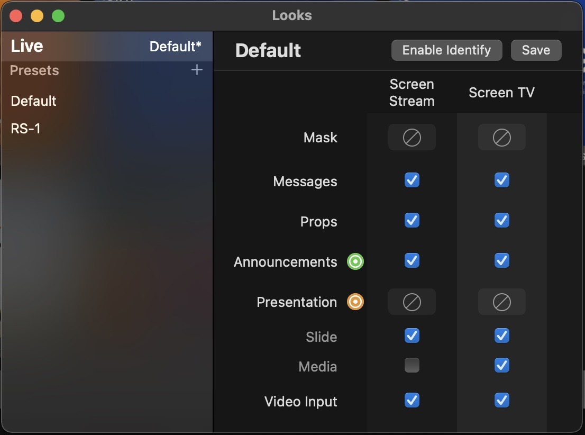

# May 12th, 2022

I modified the “Look” on ProPresenter so that it does not send the background for the slides to the livestream. I modified the keyer on the Blackmagic Designs ATEM switcher to overlay the lyrics over the video feed.

This does not change the workflow during a service for anyone. One note is, if you want to display a picture in ProPresenter on the livestream, you will need to make sure the picture in ProPresenter is set to foreground and not background.
